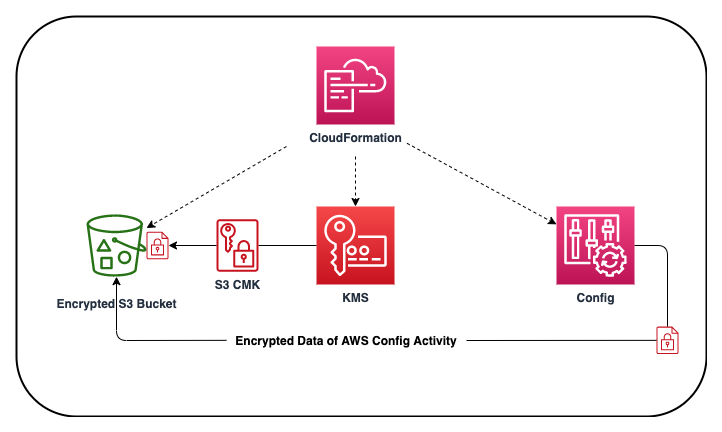

# aws-config-cf-template

## Description

This <a href="https://aws.amazon.com/cloudformation/" target="_blank">AWS CloudFormation</a> solution deploys <a href="https://aws.amazon.com/config/" target="_blank">AWS Config</a>, a service that enables you to assess, audit, and evaluate the configurations of your AWS resources. Config continuously monitors and records your AWS resource configurations and allows you to automate the evaluation of recorded configurations against desired configurations. The AWS CloudFormation template creates <a href="https://aws.amazon.com/kms/" target="_blank">AWS KMS</a> encryption keys for Config and <a href="https://aws.amazon.com/s3/" target="_blank">S3</a>, and enables Config for the account.

Config logs are encrypted (AES-256) and stored in an encrypted (AES-256) S3 bucket that the CloudFormation template creates. For security and compliance it is important all AWS account activity is tracked and stored for tracking and analysis.

AWS CloudFormation provides a common language for you to describe and provision all the infrastructure resources in your cloud environment.

Using AWS Config, you can assess, audit, and evaluate the configurations of your AWS resources. Config continuously monitors and records your AWS resource configurations and allows you to automate the evaluation of recorded configurations against desired configurations. With Config, you can review changes in configurations and relationships between AWS resources, dive into detailed resource configuration histories, and determine your overall compliance against the configurations specified in your internal guidelines. This enables you to simplify compliance auditing, security analysis, change management, and operational troubleshooting.

## AWS Resource Costs

As with most AWS services you will incur costs for usage. For this CloudFormation template the resources that incur costs are as follows

* Pricing:
   * <a href="https://aws.amazon.com/s3/pricing/" target="_blank">S3 pricing</a>
   * <a href="https://aws.amazon.com/kms/pricing/" target="_blank">KMS pricing</a>
   * <a href="https://aws.amazon.com/config/pricing/" target="_blank">Config pricing</a>

## Prerequisites

* <a href="https://aws.amazon.com" target="_blank"> Amazon Web Services Account</a>
* <a href="https://aws.amazon.com/iam/" target="_blank">IAM</a> user with the following permissions:
   * AWSCloudFormationReadOnlyAccess
   * AWSConfigFullAccess
   * AWSKeyManagementServicePowerUser
   * AmazonS3FullAccess

## CloudFormation Template

* The CloudFormation Template is available on GitHub:
   * <a href="https://github.com/getcft/aws-config-cf-template" target="_blank">aws-config-cf-template</a>

## Deploy the CloudFormation Template

* AWS Management Console

   * Login to *AWS Management Console*
   * Launch under *CloudFormation* your *aws-config-cf-template.yml* (included in this repo)

* CloudFormation Fields:

   * *Stack name* (Enter a name to associate to your AWS Config deployment)
   * Continue choosing *Next* and then *Create* (it may take several mintues to create resources)
   * Note make sure you check the box at the bottom of the create page "I acknowledge that AWS CloudFormation might create IAM resources."

## Results of the CloudFormation Template

In the *AWS Management Console* you should be able to *verify* the following have been created.

* Resources Created:
   * An S3 KMS CMK encryption key for AWS Config
   * AWS Config Recorder
   * AWS Config Delivery Channel
   * An Encrypted S3 Bucket for AWS Config
   * AWS Config IAM Role
   * AWS Config enabled for the specific region with encrypted activity logs
